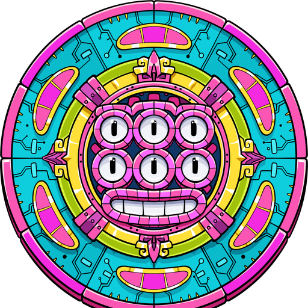
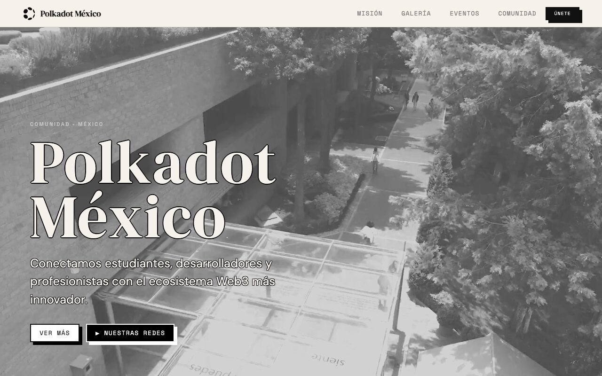
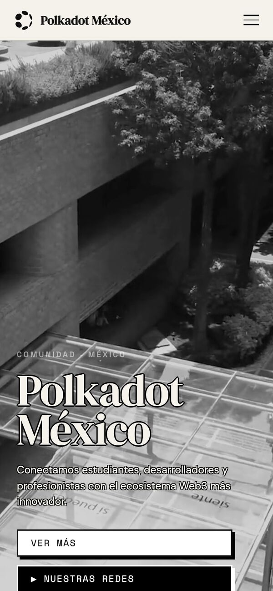
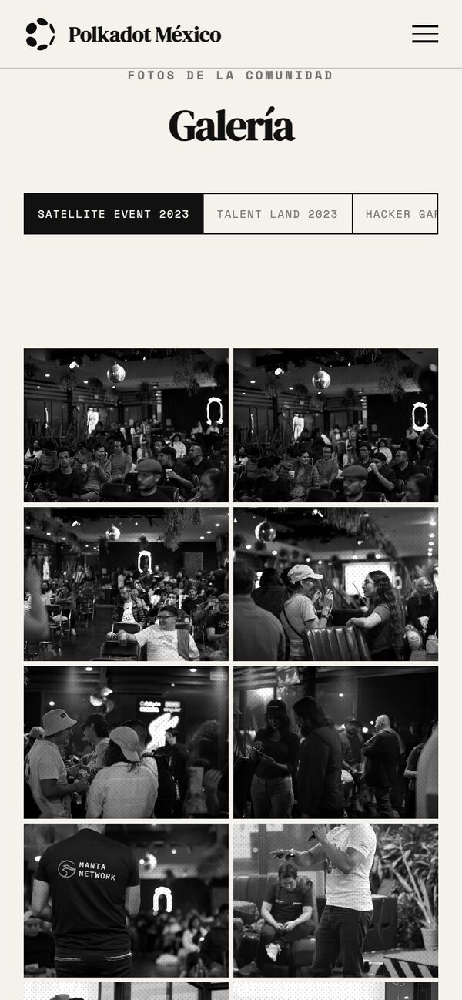
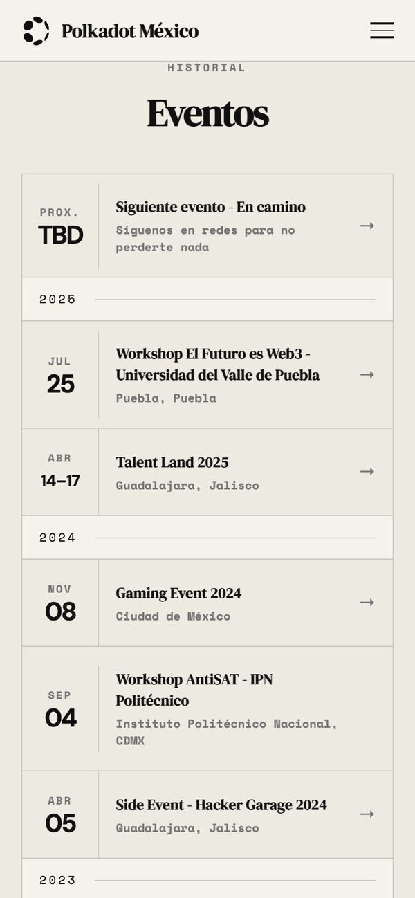
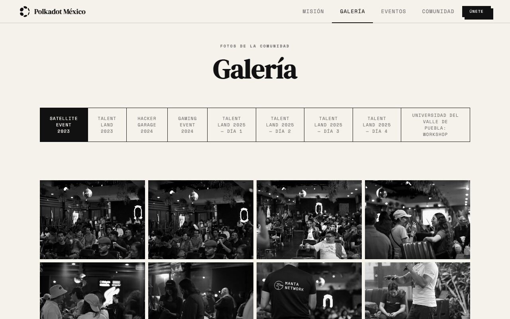
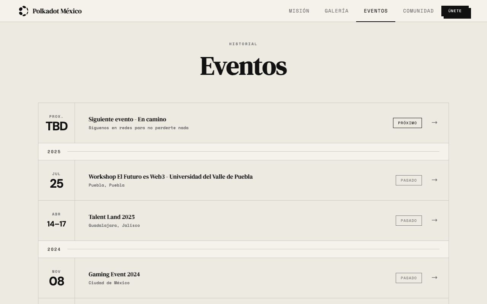

<div align="center">



# Polkadot México

**La comunidad independiente de Polkadot en México.**

Sitio oficial de la comunidad: eventos, galería, videos, Twitter Spaces y redes.
HTML, CSS y JavaScript sin frameworks ni paso de build, publicado en Vercel.

[](https://polkadot-mexico.vercel.app)


[](LICENSE)

</div>

<p align="center">
  
</p>

---

## Contenido

- [Qué es](#qué-es)
- [Secciones del sitio](#secciones-del-sitio)
- [Estructura del repositorio](#estructura-del-repositorio)
- [Inicio rápido](#inicio-rápido)
- [Agregar contenido](#agregar-contenido)
- [Verificación](#verificación)
- [Deploy](#deploy)
- [Documentación](#documentación)
- [Pendientes](#pendientes)
- [Licencia](#licencia)

## Qué es

Desde 2023, Polkadot México organiza workshops en universidades, eventos satélite,
meetups y Twitter Spaces para acercar a estudiantes y desarrolladores al ecosistema
Polkadot. Este sitio es su carta de presentación: qué hace la comunidad, dónde ha
estado y cómo unirse.

Es un sitio estático de una sola página: cinco pestañas que se muestran y ocultan
con JavaScript, sin router, sin dependencias y sin compilar nada. Lo que está en el
repo es exactamente lo que se publica.

<table>
  <tr>
    <td width="33%"></td>
    <td width="33%"></td>
    <td width="33%"></td>
  </tr>
  <tr>
    <td align="center"><sub>Portada</sub></td>
    <td align="center"><sub>Galería: 9 álbumes, swipe entre álbumes</sub></td>
    <td align="center"><sub>Eventos por año, cada uno abre su álbum</sub></td>
  </tr>
</table>

## Secciones del sitio

| Pestaña | Qué muestra |
| --- | --- |
| **Home** | Video de portada en blanco y negro, ticker y cifras de la comunidad (años, eventos, universidades, personas alcanzadas) |
| **Misión** | Quiénes somos, pilares (educación, eventos, OpenGov), cita, slideshow «La comunidad en acción» y 3 videos de YouTube |
| **Galería** | 9 álbumes con 180 fotos, lightbox con teclado y swipe |
| **Eventos** | Historial del más reciente al más antiguo, separado por año; los eventos con álbum abren su galería |
| **Comunidad** | Twitter Spaces, tweets sobre la comunidad (dos filas en movimiento), blog y redes |

El llamado a unirse (CTA) y el footer aparecen en todas las pestañas. Al cargar,
un loader ilumina por partes el logo de Polkadot México durante 4 segundos.

<table>
  <tr>
    <td width="50%"></td>
    <td width="50%"></td>
  </tr>
</table>

## Estructura del repositorio

```
polkadot-mexico-web/
├── index.html              # Marcado de las 5 pestañas, SEO y JSON-LD
├── css/
│   └── styles.css          # Fuentes, estilos y responsive (768 px y 390 px)
├── js/
│   ├── loader.js           # Animación de carga (corre antes que el resto)
│   └── main.js             # Pestañas, galería, lightbox, marquees, slideshow, contadores
├── assets/
│   ├── brand/              # Logo, favicon, og-image, imagen del loader, banner
│   ├── fonts/              # Space Mono y Space Grotesk (woff2)
│   ├── images/<álbum>/     # Fotos de la galería: 01.jpg, 02.jpg… (+ cover.jpg)
│   ├── spaces/             # Portadas de Twitter Spaces (WebP)
│   ├── tweets/             # Capturas de tweets (WebP)
│   └── video/hero.mp4      # Video de portada
├── brand-kit/              # Logos y arte que el sitio no usa (no se publica)
├── docs/                   # Guías: contenido, arquitectura, diseño y deploy
├── scripts/
│   └── check.mjs           # Verificación antes de publicar (sin dependencias)
├── .github/workflows/      # CI: corre scripts/check.mjs en cada push y PR
├── favicon.ico
├── robots.txt
├── sitemap.xml
├── vercel.json             # Redirige URLs viejas (og-image, favicon, logo)
└── .vercelignore           # Lista blanca: qué se publica y qué no
```

Álbumes de la galería:

| Pestaña | Id | Carpeta |
| --- | --- | --- |
| Satellite Event 2023 | `satellite` | `assets/images/satellite-2023/` |
| Talent Land 2023 | `talent` | `assets/images/talent-land-2023/` |
| Hacker Garage 2024 | `hacker` | `assets/images/hacker-garage-2024/` |
| Gaming Event 2024 | `gaming` | `assets/images/gaming-event-2024/` |
| Talent Land 2025, días 1 a 4 | `tl25d1` … `tl25d4` | `assets/images/talent-land-2025/day-1/` … `day-4/` |
| Universidad del Valle de Puebla: Workshop | `uvp` | `assets/images/uvp-workshop-2025/` |

## Inicio rápido

```bash
git clone https://github.com/w3nerick/polkadot-mexico-web.git
cd polkadot-mexico-web
python3 -m http.server 8000
```

Abre <http://localhost:8000>. No hay nada que instalar ni compilar.

> Usa un servidor local en vez de abrir `index.html` con doble clic: desde `file://`
> los videos de YouTube pueden no cargar.

## Agregar contenido

Cada receta, con comandos y plantillas, está en la
[guía de contenido](docs/content-guide.md).

| Quiero… | Toco | Receta |
| --- | --- | --- |
| Agregar fotos a un álbum | `assets/images/<álbum>/`, `index.html`, `js/main.js` | [Fotos](docs/content-guide.md#agregar-fotos-a-un-álbum) |
| Crear un álbum | lo anterior + pestaña + `tabOrder` | [Álbum nuevo](docs/content-guide.md#crear-un-álbum) |
| Agregar un evento | `index.html` (pestaña Eventos) | [Eventos](docs/content-guide.md#agregar-un-evento) |
| Agregar un tweet | `assets/tweets/` + las dos filas del marquee | [Tweets](docs/content-guide.md#agregar-un-tweet) |
| Agregar un Twitter Space | `assets/spaces/` + `spaces-row1` | [Spaces](docs/content-guide.md#agregar-un-twitter-space) |
| Cambiar videos, slideshow o cifras | `index.html` | [Otros](docs/content-guide.md#videos-slideshow-cifras-y-ticker) |

Las fotos se optimizan antes de entrar al repo (máx. 1200 px, JPEG calidad 80).
Los originales se quedan fuera.

## Verificación

```bash
node scripts/check.mjs
```

```
✓ 259 rutas locales existen (con mayúsculas exactas)
✓ 254 archivos de assets/ en uso
✓ Galería: 9 álbumes, 180 fotos, HTML = gData = pestañas
✓ Tweets: 43 en cada fila del marquee
✓ Dominio: todo apunta a https://polkadot-mexico.vercel.app
✓ Peso: fotos ≤ 500 KB y ≤ 1200 px, tweets ≤ 200 KB y ≤ 600 px, spaces ≤ 150 KB y ≤ 800 px
```

Atrapa los errores que no se ven en la Mac pero sí en producción: una ruta con la
mayúscula equivocada (macOS no distingue `Foto.JPG` de `foto.jpg`, Vercel sí), una
foto que no se agregó a git, una foto en el HTML que falta en `gData` (o al revés),
un tweet en una sola fila o un dominio a medio cambiar. GitHub Actions lo corre en
cada push a `master` y en cada pull request.

## Deploy

Vercel está conectado al repo: cada push a `master` publica en producción y cada
rama o pull request recibe un preview con URL propia.

```bash
node scripts/check.mjs
git push origin master        # → https://polkadot-mexico.vercel.app
```

`.vercelignore` es una lista blanca: solo se publican `index.html`, `css/`, `js/`,
`assets/`, `favicon.ico`, `robots.txt` y `sitemap.xml`. Verificación después del
deploy, rollback y cambio de dominio en [docs/deploy.md](docs/deploy.md).

## Documentación

| Documento | Para qué |
| --- | --- |
| [Guía de contenido](docs/content-guide.md) | Fotos, álbumes, eventos, tweets, spaces, videos y cifras, paso a paso |
| [Arquitectura](docs/architecture.md) | Cómo funciona por dentro: pestañas, orden de carga, loader, galería, marquees |
| [Sistema de diseño](docs/design-system.md) | Colores, tipografía, componentes y breakpoints |
| [Deploy](docs/deploy.md) | Publicar, verificar, volver atrás y cambiar de dominio |

## Pendientes

- `assets/video/hero.mp4` pesa 48 MB y no tiene `poster`: recomprimir y agregar una imagen fija.
- Las fotos de la galería tienen `alt=""`: agregar descripciones.
- 18 enlaces con `target="_blank"` no llevan `rel="noopener"`.
- El JSON-LD no incluye YouTube ni Instagram en `sameAs`.
- «Próximo evento» apunta a X; podría apuntar a lu.ma/polkadotmexico.
- Dominio propio: la lista de qué cambiar está en [docs/deploy.md](docs/deploy.md#cambiar-de-dominio).

## Licencia

El código (HTML, CSS y JavaScript) está bajo [MIT](LICENSE).

Las fotos, videos, capturas y logotipos pertenecen a Polkadot México y a sus
autores, y no están cubiertos por esa licencia. El nombre y el logo de Polkadot son
marcas de Web3 Foundation. El calendario azteca de `brand-kit/` es arte de
maravillabooy.
